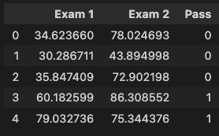
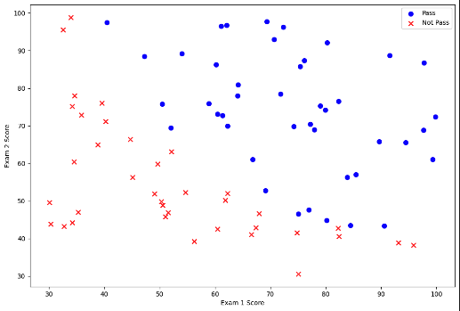
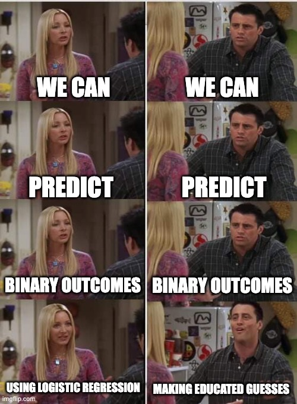
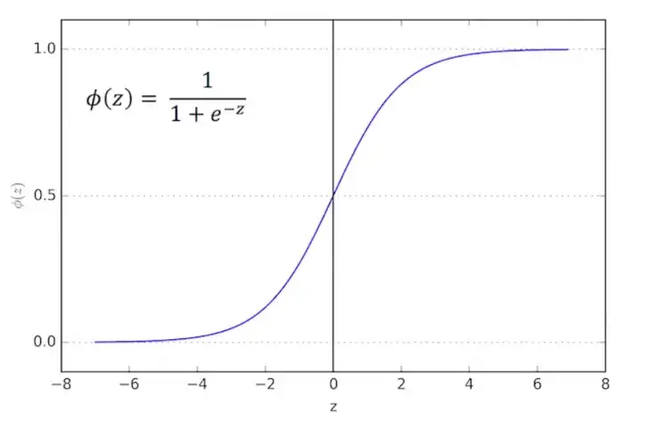
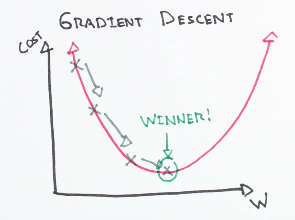

# How can Data Science benefit from Software Engineering

About ten years ago, Harvard Business Review coined Data Scientist ["the sexiest job"](https://hbr.org/2012/10/data-scientist-the-sexiest-job-of-the-21st-century) of the 21st century. Ever since the field has experienced an influx of new joiners from all backgrounds: Social scientists solving complex sociological dilemmas, mathematicians intrigued by the practical applications of statistics, or Computer Scientists interested in building cutting-edge features based on rich data.

## But wait, what exactly is Data Science

Even defining the field with a single sentence leads to necessary oversimplifications. Most practitioners can somehow agree on the following Venn diagram of core expertise within Data Science:


While diversity drives innovation, a heterogeneous field of practitioners toughens the introduction of best practices. After all, the daily challenges of a political researcher investigating voting patterns diverge strongly from a development team fine-tuning face recognition techniques for your smartphone.
Where does this lead us as engineers, either working on a Data Science task or interacting with code that has to meet the requirements of scalable production code? Often with a disconnect between domain/ statistics expertise and best practices in Computer Science.

## So, why should we care?

Data Scientists have successfully contributed to some of the most exciting inventions of the last decades - and many Data Scientists within IT departments already utilize the toolset of software engineers...?

Because a lot of researchers, especially the ones not trained as traditional Software Engineers, might even be oblivious to the streamlined approach that many IT projects take. Writing tests, scaling code for high user numbers, outsourcing computing powers to cloud servers, documenting the work, or code modularization represent just a few examples that might make the life of a Data Scientist easier.

But while abstract concepts are excellent in theory, let us tackle a simple problem in two ways: First, how a small team of Data Scientists might explore. Second,re-approaching it as a Software Engineer, keeping some best practices in mind.

## Let's look at it in action

We will illustrate the diverging approaches with a simple prediction task: Given two exam scores, how likely a student is to pass a given class[^1].

### The data

The data includes 100 observations, with two exam scores between 0 and 100 and one binary indicator of passing or not. The data is entirely made-up and allows for some predictability **without** being a fully deterministic indicator (for example, a summed score of 170 leads to passing the class).

### The setup

We will use a typical setup for Data Science and solve this task in Python, the go-to tool for data science due to its [popularity](https://www.tiobe.com/tiobe-index/), ease of use, and extensive library universe geared towards data science. We will also solve the problem in a [Jupyter Notebook](https://jupyter.org/) for the data scientist, allowing a detailed description alongside the code. This notebook style combines the line-by-line rendering of [R](https://www.r-project.org/) - another popular choice in Data Science - with inline visualizations and direct documentation.

## Approach 1: The Data Scientist

Nice, let us get into the code! Wherever necessary to follow along, optional statistical or Data Science-related asides will ensure we are all on the same page to understand the problem. But do not worry - we keep the statistics hammering to a minimum.

First, we need to load the data:

```python
path = './data/exam_data.txt'
data = pd.read_csv(path, header=None, names=['Exam 1', 'Exam 2', 'Pass'])
data.head()
data.shape()
```



We can see the first five observations of the data and the overall shape of the data: (100, 3).

We do not want to train our model on the same data that we will eventually benchmark it against, so we need to split the data into a training and a test data set - we will aim for a standard 80:20 split.

```python
training = data[:80]
test = data[80:]
```

So let us examine the data a bit - how are passing students' test scores distributed in comparison to failing ones:

```python
positive = training[training['Pass'].isin([1])]
negative = training[training['Pass'].isin([0])]

fig, ax = plt.subplots(figsize=(12,8))
ax.scatter(positive['Exam 1'], positive['Exam 2'], s=50, c='b', marker='o', label='Pass')
ax.scatter(negative['Exam 1'], negative['Exam 2'], s=50, c='r', marker='x', label='Not Pass')
ax.legend()
ax.set_xlabel('Exam 1 Score')
ax.set_ylabel('Exam 2 Score')
```



This visualization gives us the first hint that there might be some relationship between the two exam scores[^2] individually and towards the dependent variable, i.e., the student passing or failing.

But how to best quantify this notion? We will use a _logistic regression_ model to predict whether students pass the class based on the exam scores.
Oh, oh, statistics...

<div style="display: flex; flex-direction: column;  align-items: center; text-align: center">
    
</div>

---

### Technical aside: **Logistic regression**

So, a model to predict a binary outcome (read here: yes or no / 1 or 0 / pass and not pass) will need to map some mathematical result to a binary outcome variable. Therefore, it will usually map values above a threshold to one. This result space represents the main difference from the more popular linear regression, where the result displays a continuous number. In the case of logistic regression, the mapping function takes on the form of a sigmoid function, with z representing the linear model: $z = \beta_0 + \beta_1 \Chi$:

<div style="display: flex; flex-direction: column;  align-items: center; text-align: center">
    
    <p>Source: <a href="https://towardsdatascience.com/logistic-regression-a-simplified-approach-using-python-c4bc81a87c31">Logistic Regression - A simplified approach using python</a></p>
</div>

---

That is enough theory for now, and let us continue with the more exciting implementation and define the sigmoid function in code:

```python
def sigmoid(z):
    return 1 / (1 + np.exp(-z))
```

We need to do some data cleanup and define a cost function. What is a cost function, you ask?

---

### Technical aside: **Cost functions in Machine Learning**

Machine Learning means that our model learns from the data - but how? Well, by iterating over the observations and optimizing the parameters accordingly. Two main ingredients determine how far and in which direction the model moves: the **gradient** and **cost** functions.

The **cost function** tells us how wrong a certain model prediction is, given a set of model parameters.

The **gradient function** fine-tunes the model parameters (which weight to assign the first and second exam score, for example) by not just randomly plotting in numbers. It systematically moves towards a point minimizing the cost function - I will refrain from the calculus to find the derivative of the cost function here, but you get the gist of it.

<div style="display: flex; flex-direction: column;  align-items: center; text-align: center">
    
    <p>Source: <a href="https://ml-cheatsheet.readthedocs.io/en/latest/gradient_descent.html">ML Cheatsheet: Gradient Descent</a></p>
</div>

---

So, to make the vectorized computation easier, let us do some clean up:

```python
# add an additional column of ones to simplify the matrix multiplication
training.insert(0, 'Ones', 1)
test.insert(0, 'Ones', 1)

# set X (training data) and y (target variable)
cols_training = training.shape[1]
cols_test = test.shape[1]
X_training = training.iloc[:,0:cols_training-1]
X_test = training.iloc[:,0:cols_test-1]
y_training = training.iloc[:,cols_training-1:cols_training]
y_test = training.iloc[:,cols_test-1:cols_test]

# convert to numpy arrays and initalize the parameter array theta
X_training = np.array(X_training.values)
X_test = np.array(X_test.values)
y_training = np.array(y_training.values)
y_test = np.array(y_test.values)
theta = np.zeros(3)
```

We can now define our gradient function to iterate through the data and - for the sake of simplicity - leverage a popular Python library to update the model parameters using the gradient function we define as:

```python
def gradient(theta, X, y):
    theta = np.matrix(theta)
    X = np.matrix(X)
    y = np.matrix(y)

    parameters = int(theta.ravel().shape[1])
    grad = np.zeros(parameters)

    error = sigmoid(X * theta.T) - y

    for i in range(parameters):
        term = np.multiply(error, X[:,i])
        grad[i] = np.sum(term) / len(X)

    return grad
```

Given the gradient function, we can optimize the model parameters (the weights given to the two test scores) with [SciPy](https://scipy.org/):

```python
import scipy.optimize as opt

result = opt.fmin_tnc(func=cost, x0=theta, fprime=gradient, args=(X_training, y_training))
result
```

So, this it is. We are done. We have found an optimal model to predict students' passing or not passing based on the two exam scores. But wait, how well are we doing? We will need a predictor function to run on the test data set to determine that:

```python
def predict(theta, X):
    probability = sigmoid(X * theta.T)
    return [1 if x >= 0.5 else 0 for x in probability]
```

We can see that we run a set of observations (only the X values, though, therefore, only the exam scores) through our sigmoid function and then make a hard cut-off above or below 0.5 probability to predict passing or not. We can then compare these values to the actual Y values we had in the data for these observations to see how accurate our predictions were:

```python
theta_min = np.matrix(result[0])
predictions = predict(theta_min, X_test)
correct = [1 if ((a == 1 and b == 1) or (a == 0 and b == 0)) else 0 for (a, b) in zip(predictions, y_test)]
accuracy = (sum(map(int, correct)) % len(correct))
```

This model correctly predicts 71% of our test data observations, which is not bad, assuming that the test and the training data are from the same population. Still, the model has only learned from the entirely independent observations of the training data.

## Approach 2: The Software Engineer

So far, we have read a good bit about how a data scientist tackles a classification problem, have been reminded of university-level statistics, and have not covered anything this blog post promised: How to marry data science and software engineering best.

The detailed explanation was necessary, though, to better comprehend the complexity of decisions made by a data scientist.

While many engineering problems can take one of two routes, data scientists must select (and often first test) from a vast universe of possible tools in their kit.

Therefore, thoroughly understanding some of the methods to solve the problem will become valuable when deciding on a target architecture for code modularization - unfortunately, there is no one-size-fits-all solution.

[^1]: For the sake of the example, let us assume that these are test exams, which do not fully determine if a student passes by themselves. Otherwise, this would not be a statistical but a purely additive, i.e., deterministic exercise.
[^2]: Technically, this so-called _co-variance_ between the individual predictors is not ideal. We would want to add factors to our model that are highly explicative of the dependent variable but are agnostic (independent) of each other.

Structure:

1. Introduction: Problem statement -

   1. data science is sexy --> strong influx
   2. data scientist come from diverse background (statistics?)
   3. hard to agree on best practices
   4. often coding is just a tool to get the actually interesting job done
   5. code is a mess

2. How engineers have to work to get anything done

   1. scalable
   2. testable
   3. immutable
   4. well-documented (accessible)

3. Example:

   1. Problem introduction
      1. Solve very simple data science problem two ways - quick and dirty and from an engineering perspective
   2. Data explanation, goal explanation
   3. DS Methodology:
      1. Data science: Post code snippets with explanations in between
      2. Some statistics asides (include memes)
   4. Engineering methodology:
      1. Define base classes
      2. Write tests (tdd)
      3. Mock data from backend service
      4. Document functions
   5. Illustrating possible extensions

4. Conclusion comparing the two approaches
